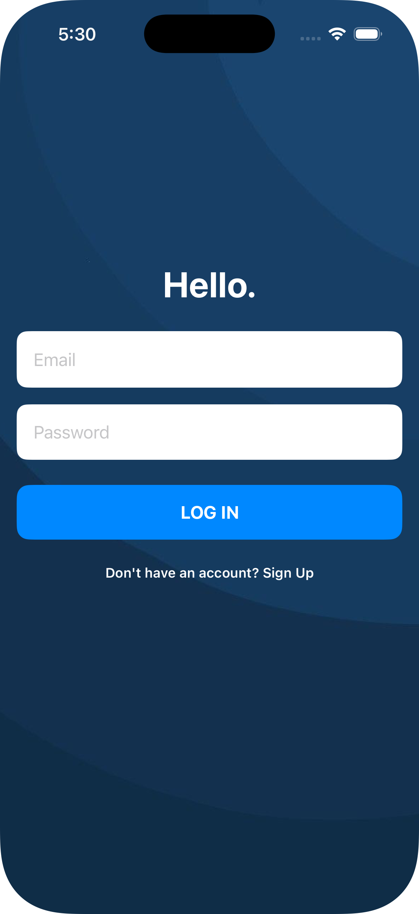
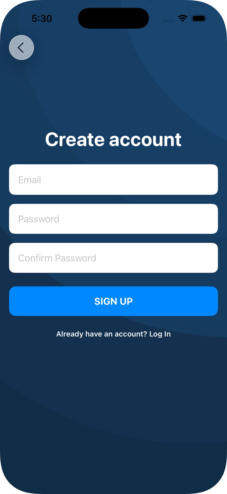
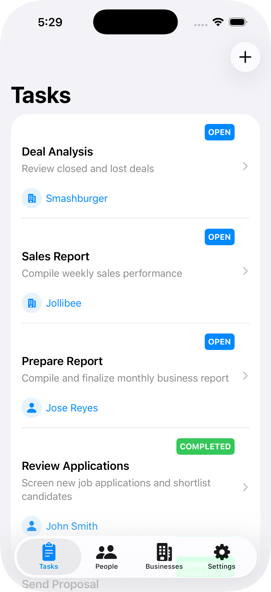
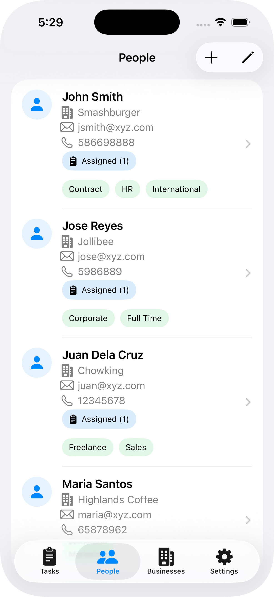
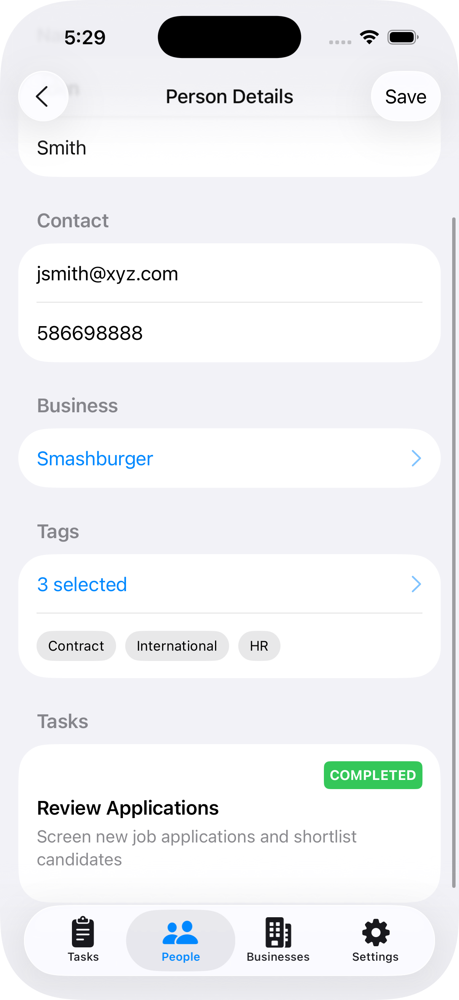
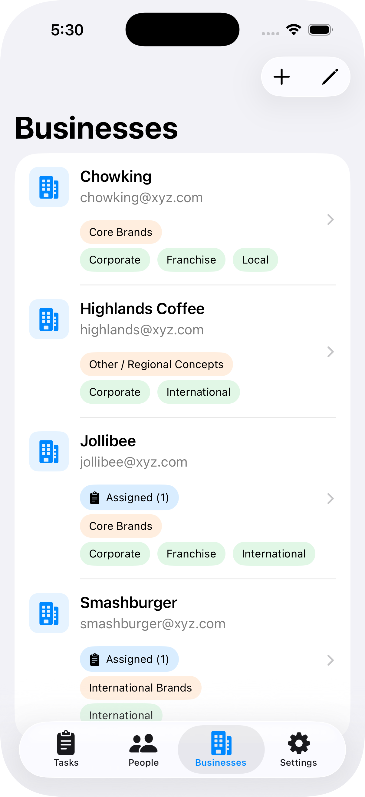
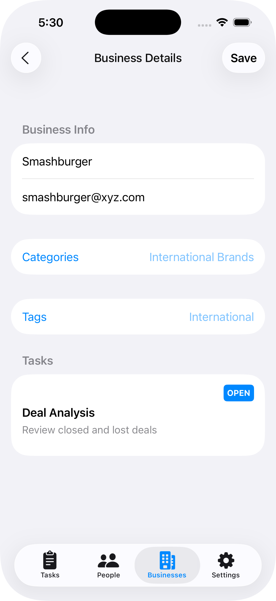
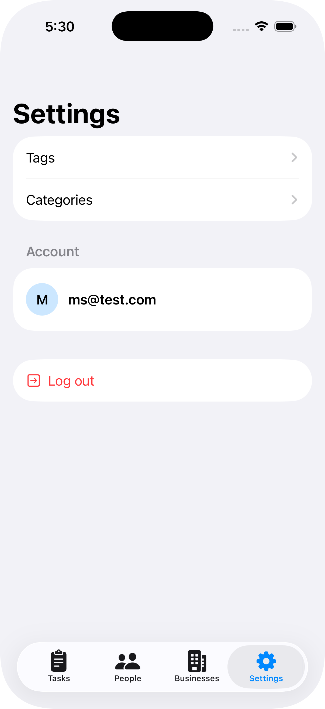
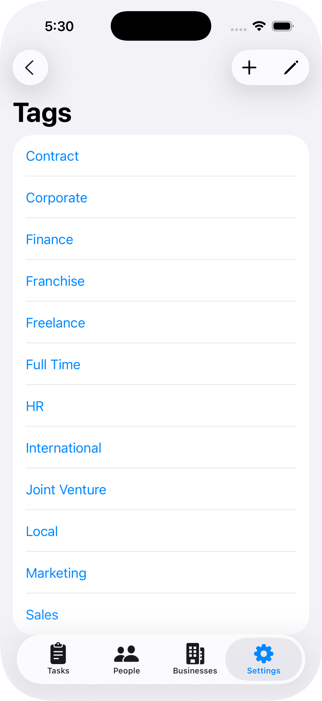
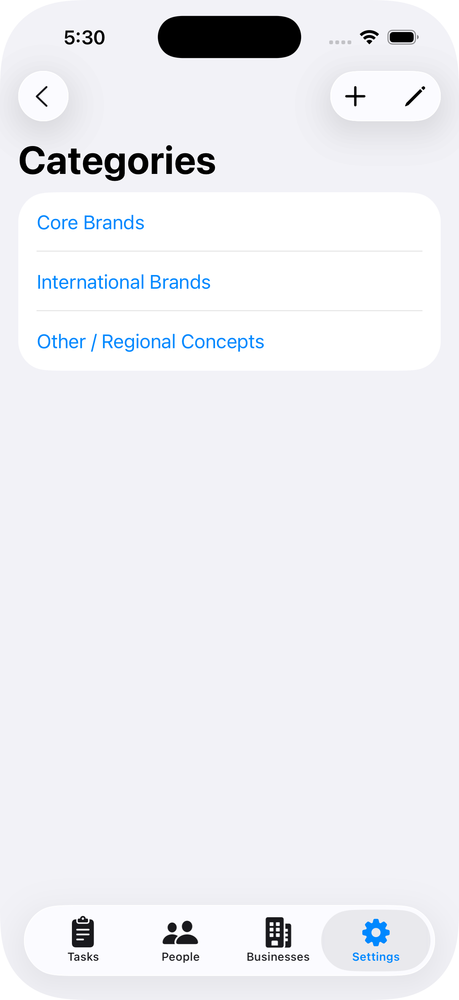

# 🚀 Nextask

A simple and modern task management app built with **SwiftUI**, designed for managing tasks, people, and business workflows.

---

## 📱 Screenshots

### Authentication
<p align="left">
  
  
</p>

### Tasks
<p align="left">
  
</p>

### People
<p align="left">
  
  
</p>

### Businesses
<p align="left">
  
  
</p>

### Profile / Settings
<p align="left">
  
  
  
</p>

---

## ✨ Features

* ✅ User authentication (Login / Register)
* 📝 Task management (Create, update, complete)
* 👥 Assign tasks to people and business
* 🏢 Business & employee tagging
* 🔍 Sorting & filtering
* 🌐 Localization support
* 🎨 Clean and modern UI

---

## 🛠 Tech Stack

* **SwiftUI**
* **Firebase Authentication**
* **Core Data**
* **MVVM Architecture**

---

## ⚙️ Setup

1. Clone the repo

```bash
git clone https://github.com/mpenaflor/nextask.git
```

2. Open in Xcode

```bash
open Nextask.xcodeproj
```

3. Run the app 🚀

---

## 🔐 Authentication

Uses Firebase for:

* Email & Password login
* Registration

---

## 👨‍💻 Author

Your Name
GitHub: https://github.com/mpenaflor

---

